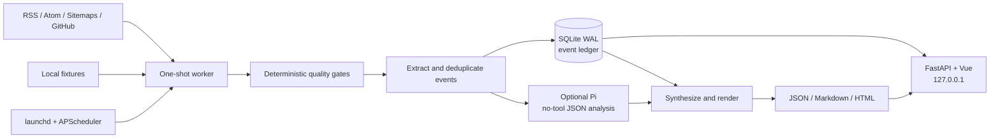

# AI Frontier Daily

[English](README.md) | [Chinese](README.zh-CN.md)

A local-first AI frontier daily briefing application. It uses a built-in read, research, and write workflow to collect primary sources, turn articles into structured events, deduplicate them across days, and include an event in the briefing only when it is new or contains a material update.

## Open source, privacy, and support scope

- Original code, prompts, and documentation in this repository are released under the MIT terms in `LICENSE`; verify copyright ownership before publishing.
- The open-source configuration does not call an agent by default. When enabled, fetched summaries, article content, and the focus profile are included in Pi prompts and may be sent to the configured remote model provider. Review that provider's privacy and data-use terms first.
- External articles, papers, GitHub repositories, and their contents remain the property of their respective owners. Keep source links in generated briefings and follow each source's terms of use.
- macOS is the supported platform. The `launchd` installation scripts are macOS-specific; other Unix systems can run the Python service manually but should not use those service scripts.
- The service binds to `127.0.0.1` by default. Do not expose the control port to a LAN or the public Internet without adding authentication, access control, and deployment isolation.

## Features

- RSS, Atom, sitemap, GitHub repository search, and local fixture collection.
- SSRF protection, redirect validation at every hop, and local HTML extraction.
- A SQLite WAL event ledger for source items, events, claims, editions, and job runs.
- Four layers of deduplication: URL, normalized content, event, and material claim.
- An event is silently dropped when it has no new material fact; new prices, APIs, weights, benchmarks, licenses, or security states are treated as progress updates.
- Constrained unattended agent analysis with no tools, extensions, skills, or context-file discovery. The agent receives only a bounded source bundle and returns structured JSON.
- Configurable local agent binary, provider, model, and thinking level through the built-in Pi CLI adapter.
- A clearly marked deterministic fallback briefing when Pi is unavailable; an old briefing is never presented as today's result.
- A FastAPI and APScheduler local control service.
- A Vue management UI for the overview, runs, live logs, event ledger, briefing preview, source switches, and scheduling settings.
- macOS `launchd` keep-alive with `RunAtLoad` and `KeepAlive`; the service owns the daily schedule to avoid duplicate schedulers.
- Same-day catch-up after sleep or service restart, a single-worker lock, process-group cancellation, and a two-hour total budget.

## Architecture

```text
launchd
  └── briefingd (FastAPI + APScheduler, 127.0.0.1:8787)
        ├── SQLite WAL
        ├── one-shot worker
        │     discover → fetch → extract → deduplicate
        │     → synthesize → render → commit
        ├── Pi no-tool JSON analysis
        └── built Vue management UI
```

Responsibilities:

- `launchd` owns process liveness.
- APScheduler owns the daily schedule.
- A worker executes one pipeline run.
- SQLite is the single source of truth for state and deduplication.
- The UI sends control intents only; it does not execute arbitrary shell commands.
- The agent performs structured event extraction and Chinese synthesis; the built-in prompts and pipeline implement the read, research, and write workflow.

## Screenshots

The screenshots below show the local management UI and a real ready edition. Paths, credentials, and private runtime settings are not included.

### Dashboard


### Briefing preview


### Event ledger


### Architecture



## Quick start

```bash
git clone https://github.com/AkianZhouG/aifrontier-daily.git
cd aifrontier-daily
scripts/briefingctl setup
scripts/briefingctl install
scripts/briefingctl open
```

Open the management UI at <http://127.0.0.1:8787>.

Run the built-in fixture smoke test without network access or a model:

```bash
scripts/briefingctl test-run
```

Run a live briefing:

```bash
scripts/briefingctl run
```

The default configuration produces a clearly marked deterministic fallback briefing and does not call a model. After configuring and explicitly enabling an agent, the pipeline can produce a model-synthesized briefing.

## Service management

```bash
scripts/briefingctl status
scripts/briefingctl start
scripts/briefingctl stop
scripts/briefingctl restart
scripts/briefingctl logs
scripts/briefingctl uninstall   # keeps data/ and logs/
```

The `launchd` service label is `com.aifrontier.daily`.

Production runs FastAPI only. Vite is for development; FastAPI serves the built frontend directly.

## Development

```bash
python3 -m venv .venv
.venv/bin/pip install -e '.[dev]'
cd frontend && npm ci && npm run build
cd ..
.venv/bin/pytest
.venv/bin/python -m compileall -q src
```

Run the backend in development:

```bash
.venv/bin/frontier-daily serve
```

Run the frontend in development:

```bash
cd frontend
npm run dev
```

Vite binds to `127.0.0.1:5174` and proxies `/api` to port 8787.

See [CONTRIBUTING.md](CONTRIBUTING.md) for contribution and verification guidance, and [SECURITY.md](SECURITY.md) for security reporting.

## Configuration

The first `frontier-daily init` copies `config/app.example.json` to the local `config/app.json`. The latter is ignored by Git.

Default configuration:

- Time zone: `Asia/Shanghai`
- Daily schedule: 08:30
- Catch-up window: 12 hours
- Lookback window: 72 hours
- Up to 8 items per edition; focus topics are preferred, then related items fill the remaining slots
- Web UI: `127.0.0.1:8787`
- Focus topics: coding agents, agent tools, agent models, local inference, inference optimization, speculative decoding, retrieval tools, skill plugins, developer workflows, agent safety, and valuable open-source projects on GitHub
- Agent: disabled by default; when enabled, configure `pi`, a provider, a model, and a thinking level

Environment variables can override configuration:

```text
FRONTIER_ROOT
FRONTIER_DATA_DIR
FRONTIER_LOGS_DIR
FRONTIER_DB
FRONTIER_HOST
FRONTIER_PORT
FRONTIER_SCHEDULE
FRONTIER_TIMEZONE
FRONTIER_LLM_ENABLED
FRONTIER_PI_BINARY          (legacy name)
FRONTIER_PI_PROVIDER        (legacy name)
FRONTIER_PI_MODEL           (legacy name)
FRONTIER_PI_THINKING        (legacy name)
FRONTIER_AGENT_BINARY
FRONTIER_AGENT_PROVIDER
FRONTIER_AGENT_MODEL
FRONTIER_AGENT_THINKING
FRONTIER_FOCUS_PROFILE
FRONTIER_AGENT_TIMEOUT
FRONTIER_PI_TIMEOUT         (legacy name)
```

The open-source configuration does not call a model by default. To enable one, copy and edit the local configuration:

```bash
cp config/app.example.json config/app.json
```

Set `agent.enabled` to `true` and fill in a provider, model, and binary that you are authorized to use. You can also use `FRONTIER_LLM_ENABLED`, `FRONTIER_AGENT_PROVIDER`, and `FRONTIER_AGENT_MODEL` to override the configuration. Run the fixture smoke test before starting a live briefing.

Sources are defined in `config/sources.json` and synchronized into SQLite on first startup. UI enablement takes precedence, so later source-definition changes do not overwrite a user's switches. Agent, model, focus-profile, and item-count changes request a briefing rebuild on the next run instead of reusing the previous selection. Focus-topic items are placed first, followed by related items until the configured limit is reached.

## Default sources

- arXiv: `cs.AI`, `cs.CL`, and `cs.LG`
- Hugging Face Blog
- Microsoft Research
- NVIDIA Developer Blog
- OpenAI official news RSS
- Anthropic sitemap
- Google DeepMind research sitemap
- GitHub AI open-source project search: finds recently created, non-forked, non-archived repositories with recognizable licenses within the lookback window, uses Stars and Forks only as discovery signals, and fetches the repository page as primary material

Search results are discovery hints. Published claims should retain an official or paper source. A GitHub repository can be a project's primary source, but Stars and Forks do not prove quality or security. Lower-tier sources reduce confidence.

## External sources and third-party content

This project provides source discovery, fetching, structured extraction, and local report generation; it does not claim ownership of fetched articles, papers, repositories, or trademarks. Users are responsible for complying with source terms of service, robots rules, API limits, and copyright requirements. Do not submit full-text content, private data, or materials requiring authorization to a third-party model service without permission.

## Quality gates

Admission has three layers, and the results are recorded in source-item `metadata_json.quality` and run logs:

1. **Deterministic material gate:** scores source tier, body or abstract length, publication time, and concrete technical or quantitative detail from 0 to 100. Event, hiring, weekly roundup, and other low-signal titles are rejected. Per-source thresholds live in `config/sources.json`.
2. **Source-specific gate:** GitHub projects must be non-forks, non-archived, have a recognizable license, at least 10 Stars, a description of at least 40 characters, at least 1,200 characters of README or body content, and at least three signals across installation, usage, examples, tests, evaluations, documentation, licensing, and deployment.
3. **Event-value gate:** extracted events are checked again. Official and paper sources require at least 65 importance; GitHub community projects require at least 75. Popularity does not contribute to event importance.

Default material thresholds are 50–55 for official sources, 60 for papers, and 70 for GitHub. GitHub Stars are only a minimum community-validation signal; they do not replace code review, independent evaluation, or security verification. Thin wrappers, simple rebrands or forks, tutorials, prompt collections, generic chat clients, model aggregators, and demos without tests or documentation are excluded by prompt rules or the event-value gate. Changes to the quality policy request a rebuild of the current edition; old community projects are not grandfathered into a new policy.

## Deduplication

### URL layer

Remove `utm_*`, `ref`, and fragment identifiers; normalize hostname, port, and trailing slash.

### Content layer

Normalize the body and compute SHA-256. Identical content under different URLs is not sent to the model twice.

### Event layer

The model emits a stable event key:

```text
entity | subject-or-version | event-type
```

Examples:

```text
openai|astra|safety
deepseek|v4-flash-vision-exp|release
```

### Material-claim layer

An event returns to the briefing only when it gains a new material fact. Material facts include:

- availability or release-stage changes;
- new APIs, model weights, or licenses;
- new prices, parameters, or benchmark results;
- security levels, incident status, or policy changes;
- independent reproductions or formal paper results.

Ordinary media paraphrases, title changes, and social reposts are not material updates.

## Run states

```text
queued → discover → fetch → extract → deduplicate
        → synthesize → render → commit → completed
```

A run can fail or be cancelled at any stage. An edition is marked `ready` or `partial` only after its JSON and HTML artifacts exist and the SQLite transaction commits. Internal database states remain in English for programmatic use.

- `ready`: event extraction and briefing synthesis both used Pi.
- `partial`: deterministic fallback summaries were used and the UI explains the evidence limitation.
- `no-change`: a briefing for the date already exists and a rerun found no material update; existing artifacts are preserved.

## Data directory

Runtime data is written to the Git-ignored `data/` directory:

```text
data/frontier.sqlite3
data/editions/YYYY-MM-DD/edition.json
data/editions/YYYY-MM-DD/report.md
data/editions/YYYY-MM-DD/report.html
data/runs/<run-id>/
```

Logs are written to `logs/` as JSONL for incremental UI reads.

## Security boundaries

- The service refuses non-local bind addresses.
- No wildcard CORS is configured.
- Mutating endpoints require a same-origin Origin, CSRF cookie, and custom header.
- The `launchd` wrapper uses an environment allowlist instead of inheriting the entire interactive shell environment.
- Pi runs with `--no-tools --no-extensions --no-skills --no-context-files`, disabling tools, extensions, skills, and context-file discovery.
- External content is always treated as untrusted data.
- The fetcher rejects HTTP, localhost, private-network, and reserved addresses.
- Page output and generated briefings escape external text.
- No arbitrary command-execution API is provided.

Pi is not a sandbox. If future versions let the model execute tools or process higher-risk content, move the worker into a container or VM. The current design narrows the permission boundary by using a no-tool model invocation.

## API

Main read-only endpoints:

```text
GET /api/health
GET /api/dashboard
GET /api/runs
GET /api/events
GET /api/editions
GET /api/sources
GET /api/settings
GET /api/stream
```

Main control endpoints:

```text
POST  /api/runs
POST  /api/runs/{id}/cancel
POST  /api/runs/{id}/retry
POST  /api/events/{id}/action
PATCH /api/sources/{id}
PUT   /api/settings
POST  /api/scheduler/pause
POST  /api/scheduler/resume
```

Control endpoints accept structured payloads only and expose no arbitrary command strings.
