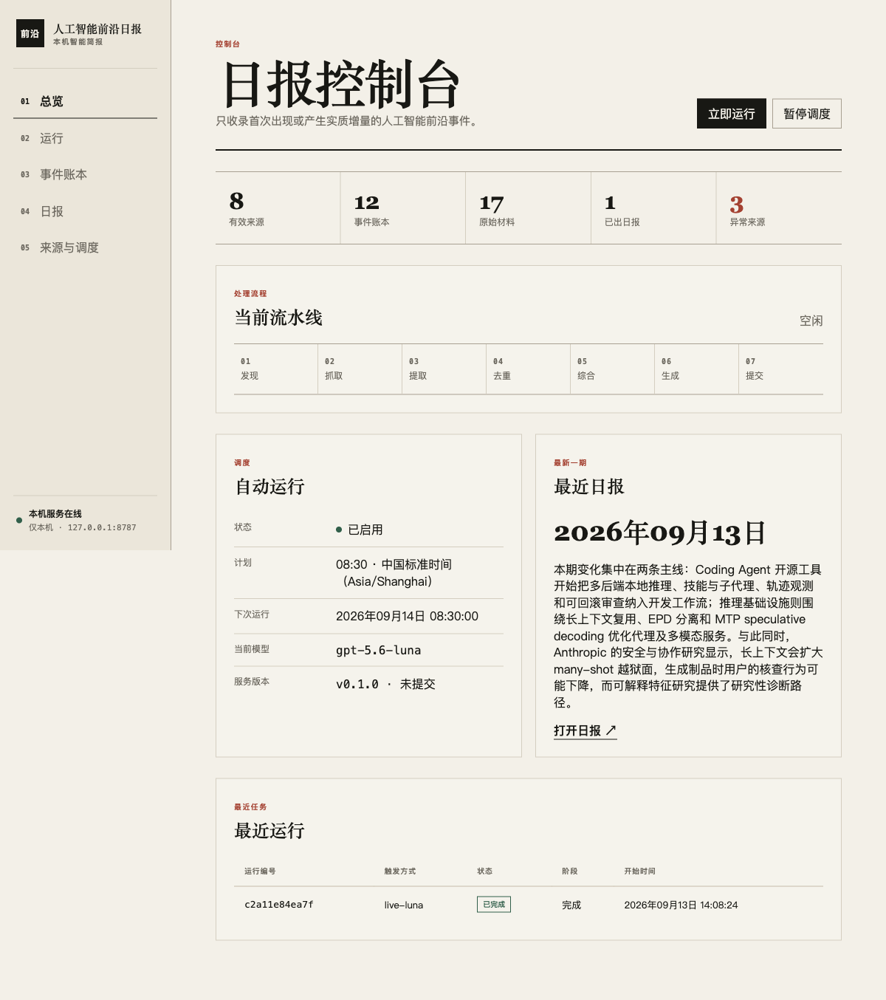
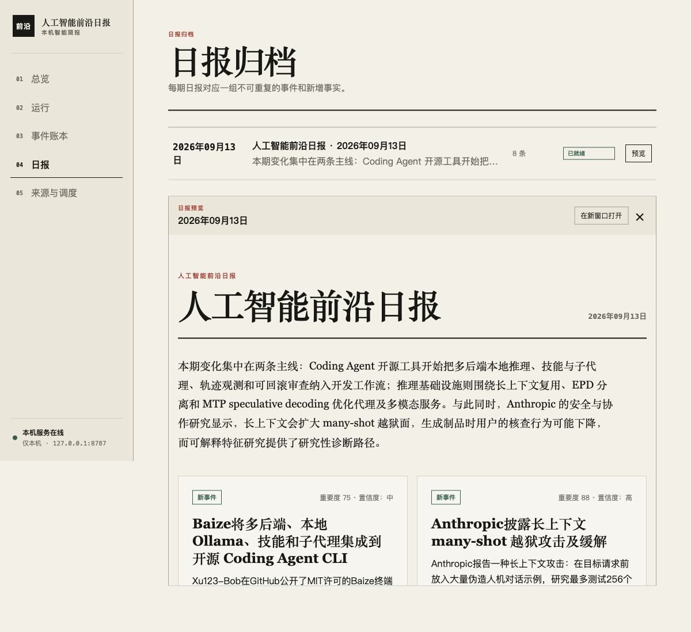
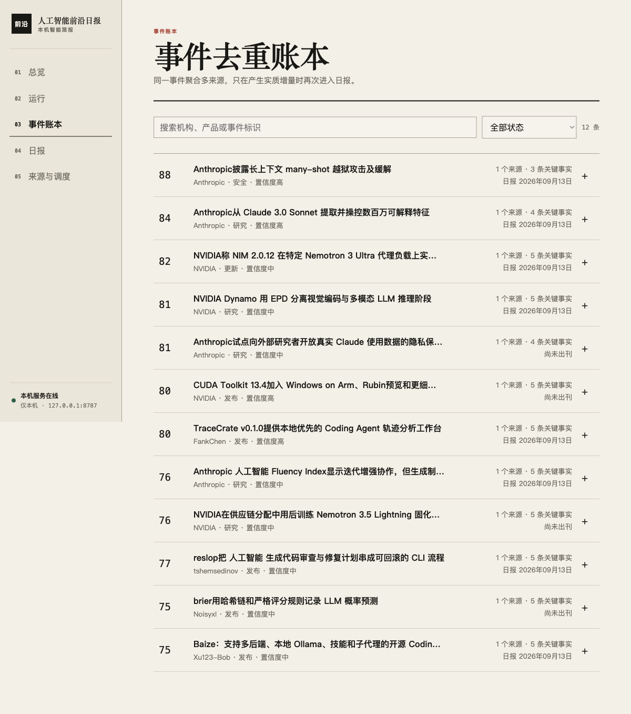
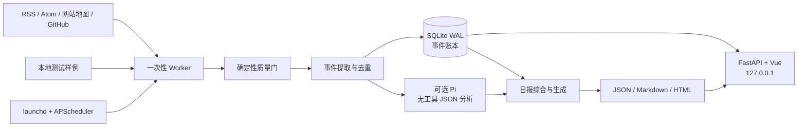

# 人工智能前沿日报

[English](README.md) | [简体中文](README.zh-CN.md)

本机运行的人工智能前沿日报应用。它按内置的“读取 → 研究 → 写作”流程收集一手来源，把文章转换成结构化事件，跨天去重，只在事件首次出现或产生实质增量时进入日报。

## 开源、隐私与支持范围

- 本仓库中的原创代码、提示词和文档按 `LICENSE` 中的 MIT 条款发布；发布前请确认代码和相关材料的版权归属。
- 开源版默认不调用智能代理。启用后，抓取到的摘要、正文和关注主题会进入 Pi 的提示词，并可能发送给配置的远程模型提供方；请先确认该提供方的隐私政策和数据使用条款。
- 外部文章、论文、GitHub 仓库及其内容不属于本项目，日报应保留原始来源链接并遵守各来源的使用条款。
- 当前正式支持 macOS；`launchd` 安装脚本只适用于 macOS。其他 Unix 系统可以手动运行 Python 服务，但不使用这些 macOS 服务脚本。
- 服务默认只绑定 `127.0.0.1`。除非你已经补充身份认证、访问控制和部署隔离，不要把管理端口暴露到局域网或公网。

## 当前能力

- RSS、Atom、网站地图、GitHub 开源仓库搜索和本地测试样例采集。
- SSRF 防护、重定向逐跳校验、本地 HTML 正文提取。
- SQLite WAL 事件账本，保存来源、文章、事件、关键事实、日报和运行记录。
- URL、正文、事件和关键事实四层去重。
- 同一事件无新增事实时静默丢弃；新增价格、API、权重、基准测试、许可证或安全状态时作为“进展更新”。
- 受约束的智能代理非交互分析：无工具、无扩展、无技能发现、无上下文文件；只接收流水线提供的有限来源材料并返回结构化 JSON。
- 支持指定本地智能代理工具、提供方、模型和思考级别；当前内置 Pi 命令行适配。
- Pi 不可用时生成明确标记的确定性降级日报，不使用旧日报冒充。
- FastAPI + APScheduler 本地控制服务。
- Vue 管理页：总览、运行记录、实时日志、事件账本、日报预览、来源开关和调度设置。
- macOS launchd `RunAtLoad + KeepAlive` 保活，服务内部负责日程，避免双调度。
- 睡眠或服务重启后的当日补跑、单 Worker 锁、子进程组取消和两小时总预算。

## 架构

```text
launchd
  └── briefingd (FastAPI + APScheduler, 127.0.0.1:8787)
        ├── SQLite WAL
        ├── 一次性工作进程（Worker）
        │     发现 → 抓取 → 提取 → 去重
        │     → 综合 → 生成 → 提交
        ├── Pi 无工具 JSON 分析
        └── 已构建的 Vue 管理页面
```

职责边界：

- launchd 只负责进程存活。
- APScheduler 只负责日报时间。
- Worker 只执行一次流水线。
- SQLite 是状态和去重的唯一事实源。
- 页面只发送控制意图，不执行任意 Shell 命令。
- 智能代理只做结构化事件提取和中文综合；内置的读取、研究、写作流程由项目自身提示词和流水线实现，关注主题可在管理页配置。

## 样例界面

下面的截图展示本机管理界面和一份已经就绪的日报；没有包含本地路径、认证信息或私有运行配置。

### 总览控制台



### 日报预览



### 事件账本



### 架构图



## 快速开始

```bash
git clone https://github.com/AkianZhouG/aifrontier-daily.git
cd aifrontier-daily
scripts/briefingctl setup
scripts/briefingctl install
scripts/briefingctl open
```

管理页：<http://127.0.0.1:8787>

首次验证可运行内置测试样例，不访问外网，也不调用模型：

```bash
scripts/briefingctl test-run
```

触发正式日报：

```bash
scripts/briefingctl run
```

默认会生成明确标记的确定性降级日报，不会调用模型；完成模型配置并显式启用后，才会尝试使用智能代理生成正式综合内容。

## 服务管理

```bash
scripts/briefingctl status
scripts/briefingctl start
scripts/briefingctl stop
scripts/briefingctl restart
scripts/briefingctl logs
scripts/briefingctl uninstall   # 保留 data/ 和 logs/
```

launchd 服务标识：`com.aifrontier.daily`。

生产环境只运行 FastAPI。Vue 的 Vite 服务仅用于开发，构建产物由 FastAPI 直接托管。

## 开发

```bash
python3 -m venv .venv
.venv/bin/pip install -e '.[dev]'
cd frontend && npm ci && npm run build
cd ..
.venv/bin/pytest
.venv/bin/python -m compileall -q src
```

后端开发：

```bash
.venv/bin/frontier-daily serve
```

前端开发：

```bash
cd frontend
npm run dev
```

Vite 只绑定 `127.0.0.1:5174`，并代理 `/api` 到 8787。

贡献和验证方式见 [CONTRIBUTING.md](CONTRIBUTING.md)，安全问题报告方式见 [SECURITY.md](SECURITY.md)。

## 配置

首次 `frontier-daily init` 会从 `config/app.example.json` 复制本地配置到 `config/app.json`。后者被 git 忽略。

默认配置：

- 时区：`Asia/Shanghai`
- 每日运行：08:30
- 补跑窗口：12 小时
- 搜索回看：72 小时
- 每期最多：8 条；关注主题优先，不足时按相关性补充其他前沿事件
- 页面端口：`127.0.0.1:8787`
- 关注主题：人工智能编程代理、智能体工具、代理模型、本地推理、推理优化、草稿模型、检索工具、技能插件、开发者工作流、智能体安全和 GitHub 有实际价值的开源项目
- 本地智能代理：默认关闭；启用后需要自行配置 `pi`、提供方、模型和思考级别

环境变量可覆盖：

```text
FRONTIER_ROOT
FRONTIER_DATA_DIR
FRONTIER_LOGS_DIR
FRONTIER_DB
FRONTIER_HOST
FRONTIER_PORT
FRONTIER_SCHEDULE
FRONTIER_TIMEZONE
FRONTIER_LLM_ENABLED
FRONTIER_PI_BINARY（兼容旧配置）
FRONTIER_PI_PROVIDER（兼容旧配置）
FRONTIER_PI_MODEL（兼容旧配置）
FRONTIER_PI_THINKING（兼容旧配置）
FRONTIER_AGENT_BINARY
FRONTIER_AGENT_PROVIDER
FRONTIER_AGENT_MODEL
FRONTIER_AGENT_THINKING
FRONTIER_FOCUS_PROFILE
FRONTIER_AGENT_TIMEOUT
FRONTIER_PI_TIMEOUT（兼容旧配置）
```

开源版本默认不会调用模型。需要启用时，先复制并编辑本地配置：

```bash
cp config/app.example.json config/app.json
```

将 `config/app.json` 中的 `agent.enabled` 改为 `true`，并填写你有权限使用的 `provider`、`model` 和 `binary`。也可以使用 `FRONTIER_LLM_ENABLED`、`FRONTIER_AGENT_PROVIDER`、`FRONTIER_AGENT_MODEL` 等环境变量覆盖配置。启用模型后，建议先用测试样例验证调用链，再运行正式日报。

来源定义在 `config/sources.json`，首次启动后同步到 SQLite；页面里的启停状态优先，后续代码更新不会覆盖用户开关。代理工具、模型和关注主题可在“来源与调度”页面修改。修改代理、模型、关注主题或每期条数后，下一次运行会重新整理日报，而不是直接沿用上一版选题。日报会先放置“关注主题”条目，再以“相关补充”填满数量上限。

## 默认来源

- arXiv：`cs.AI`、`cs.CL`、`cs.LG`
- Hugging Face 博客
- 微软研究院
- NVIDIA 开发者博客
- OpenAI 官方资讯 RSS
- Anthropic 网站地图
- Google DeepMind 研究网站地图
- GitHub AI 开源项目搜索：按回看窗口发现近期创建、非 Fork、非归档且带有可识别许可证的仓库，按 Stars 和 Forks 提供发现信号，并抓取仓库页面作为一手材料

搜索结果只作为发现线索。正式事实应保留官方来源或论文来源；GitHub 仓库本身可作为项目一手来源，但 Stars、Forks 不代表质量或安全性；低等级来源会降低置信度。

## 外部来源与第三方内容

本项目只提供来源发现、抓取、结构化整理和本地报告生成能力，不主张拥有所抓取文章、论文、仓库或商标的权利。使用者应自行遵守来源网站的服务条款、robots 规则、API 限制和内容版权要求。未经许可不要把抓取到的全文、私有数据或需要授权的材料提交给第三方模型服务。

## 质量准入

准入分为三层，并把结果记录在来源材料的 `metadata_json.quality` 和运行日志中：

1. **确定性材料门**：按来源等级、正文/摘要长度、发布时间、具体技术或量化信息计算 0 至 100 分；活动、招聘、周报等低信号标题直接拒绝。各来源可在 `config/sources.json` 中设置 `quality` 门槛。
2. **来源专项门**：GitHub 必须非 Fork、非归档、具有可识别许可证、至少 10 Stars、简介不少于 40 字符、README/正文不少于 1200 字符，并至少具备 3 类安装、用法、示例、测试、评测、文档、许可或部署信号。
3. **事件价值门**：模型提取后再次检查 importance。官方来源和论文最低 65、GitHub 社区项目最低 75；热度不计入事件重要度。

默认材料质量线：官方来源 50 至 55、论文 60、GitHub 70。GitHub 的 Stars 只作为最低社区验证信号，不能替代代码审计、独立评测或安全验证。薄封装、简单换壳/分支、教程、提示词合集、通用聊天客户端、模型聚合界面和无测试文档的 demo 会在提示规则或事件价值门中被排除。质量策略变化会自动要求下一次运行重整当期日报，旧社区项目不会自动沿用旧准入结论。

## 去重规则

### URL 层

移除 `utm_*`、`ref` 和片段标识，统一域名、端口和尾斜杠。

### 内容层

正文归一化后计算 SHA-256，同内容换 URL 不重复进入模型。

### 事件层

模型输出稳定事件键：

```text
entity | subject-or-version | event-type
```

例如：

```text
openai|astra|safety
deepseek|v4-flash-vision-exp|release
```

### 关键事实层

同一事件只在出现新的实质性事实时再次进入日报。实质性事实包括：

- 可用性或发布阶段变化
- 新 API、模型权重或许可证
- 新价格、参数或基准测试结果
- 安全等级、事故状态或政策变化
- 独立复现或正式论文结果

普通媒体转述、标题变化和社交转发不构成增量。

## 运行状态

```text
排队中 → 发现 → 抓取 → 提取 → 去重
       → 综合 → 生成 → 提交 → 已完成
```

任何阶段可进入“失败”或“已取消”。日报只有在 JSON 与 HTML 产物存在且 SQLite 事务提交成功后，才标记为“已就绪”或“部分完成”。数据库内部仍使用固定英文状态值，便于程序处理。

- “已就绪”：事件提取和日报综合均经过 Pi。
- “部分完成”：使用确定性降级摘要，页面会明确展示证据限制。
- “无变化”：当天已存在日报，重跑未发现实质增量，原产物保持不变。

## 数据目录

运行数据默认写入被 git 忽略的 `data/`：

```text
data/frontier.sqlite3
data/editions/YYYY-MM-DD/edition.json
data/editions/YYYY-MM-DD/report.md
data/editions/YYYY-MM-DD/report.html
data/runs/<run-id>/
```

日志写入 `logs/`。运行日志使用 JSONL，便于页面增量读取。

## 安全边界

- 服务拒绝绑定非本机地址。
- 无通配符 CORS。
- 写接口要求同源 Origin、CSRF cookie 和自定义 header。
- launchd 包装脚本使用环境变量白名单，不继承整个交互 Shell 环境。
- Pi 以 `--no-tools --no-extensions --no-skills --no-context-files` 运行，关闭工具、扩展、技能和上下文文件发现。
- 外部内容始终视为不可信数据。
- 抓取器拒绝 HTTP、localhost、内网和保留地址。
- 页面输出和日报均转义外部文本。
- 不提供任意命令执行 API。

Pi 本身不是沙箱。若未来让模型执行工具或处理更高风险内容，应把 Worker 移入容器或 VM；当前设计通过“无工具模型调用”收窄权限。

## API

主要只读接口：

```text
GET /api/health
GET /api/dashboard
GET /api/runs
GET /api/events
GET /api/editions
GET /api/sources
GET /api/settings
GET /api/stream
```

主要控制接口：

```text
POST  /api/runs
POST  /api/runs/{id}/cancel
POST  /api/runs/{id}/retry
POST  /api/events/{id}/action
PATCH /api/sources/{id}
PUT   /api/settings
POST  /api/scheduler/pause
POST  /api/scheduler/resume
```

控制接口不接受命令字符串，只操作固定注册能力。
